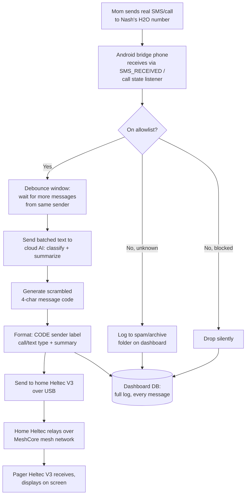
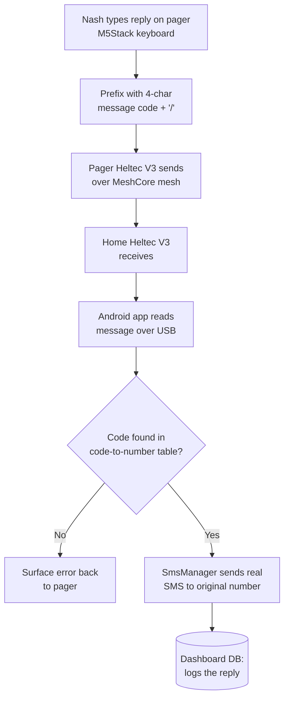

# Peel/Banana — Mesh Pager Bridge System

Sep 23, 2026

## Overview

Nash's mom lives in Atlanta; Nash is at Auburn, about 90 miles away. The goal: let her reach him without cellular service, without a pager she has to carry, and without changing how she already texts him — she keeps using his normal number.

The key move: Nash doesn't need to reinvent how his mom sends a message. He intercepts the message after it already arrives as a normal SMS, then relays it the rest of the way over an open, free mesh radio network (MeshCore) that doesn't depend on cell towers.

This is a spinoff of the original Peel pager concept, now folded under the Banana maker brand — working name **Peel/Banana**.

## Architecture

Three pieces, each with one job:

1. **Android bridge phone** (a Pixel, likely a 3a) — single-SIM, running Nash's H2O Wireless "developer" number. Sits on WiFi at home, next to the home Heltec, connected to it over USB. Its job: catch real SMS and calls, decide what matters, and translate the survivors into mesh messages.
2. **Home Heltec V3** — a MeshCore companion-radio node, mounted high (roof or top floor) for range. Bridges the Android app to the mesh network over LoRa, and acts as a repeater toward Auburn.
3. **Pager Heltec V3 + M5Stack keyboard** — Nash's pocket device. A MeshCore client node with a keyboard (I2C) for typing replies and a small screen for reading messages and scrolling back through history.

Between the pager and the bridge sits the open MeshCore mesh — free, no subscription, no cell towers required.

## Incoming: someone texts or calls Nash

If the page never reaches the pager, nothing retries automatically — the dashboard is the record of what was sent.

## Outgoing: Nash replies from the pager

If the reply never makes it from the pager back to the home Heltec, Nash's phone does nothing — no auto-retry. He just sends it again from the pager if he wants it to go through. Message codes never expire, so he can scroll back through pager history and reply to something from days ago.

## AI filtering and summarization

Runs as a small, narrowly-prompted cloud AI call (not a full agent, not a keyword/rules engine) — chosen over a rules engine because it can infer intent a keyword list would miss (e.g. "it's your mom, call me" from a number that isn't saved).

One job, tightly scoped: given a sender's number and their batched message text, return:

- **allow / block** decision, checked against the dashboard's allowlist and blocklist
- a **sender label** (name if known, otherwise a question mark)
- a short **summary** of the message(s), short enough to fit on the pager screen

Batching: if a sender sends several messages in quick succession, the bridge waits (debounce), then summarizes them into one relayed message instead of spamming the pager with each one individually.

## Message codes

Every individual relayed **message** (not the whole conversation) gets its own 4-character code — letters + digits, generated by running an incrementing counter through a deterministic, reversible scramble so codes never collide but don't look sequential (e.g. `T27B`, then `89H2` next, not `AAAA`, `AAAB`).

- 36 possible characters × 4 positions = **1,679,616 unique codes** — effectively never runs out for this device's lifetime
- Codes **never expire**: Nash can scroll back through pager history days later and reply to an old message by its code
- To reply, he types the code + `/` before his message, e.g. `T27B/sounds good, see you then`
- A couple of reserved single-character shortcuts (e.g. `+`) handle quick acknowledgments without typing a full reply

## Web dashboard and database

A SQL-backed web control center, Nash's-eyes-only, for debugging and as the source of truth when the pager misses something.

| Feature | Purpose |
| --- | --- |
| Full message/call log | Every call and text, including ones filtered out — so Nash can check whether a message someone claims to have sent actually came through |
| Spam/archive folder | Filtered-out messages land here instead of the pager; later, a count/summary so Nash knows if it's worth checking |
| Allowlist management | Add/remove people who can page him (new friends, a girlfriend) without touching the phone |
| Blocklist management | Senders who should always be blocked, separate from senders who should always get through |
| Code-to-number table | Permanent mapping of every message code ever issued to the phone number it belongs to (codes never expire) |

## Hardware

| Component | Role |
| --- | --- |
| Pixel (likely 3a) | Android bridge phone, single-SIM |
| H2O Wireless SIM | Nash's "developer SIM" — unlimited calls/text, no data, runs on AT&T |
| Heltec V3 (home) | MeshCore companion-radio node, mounted high, connected to Pixel over USB |
| Heltec V3 (pager) | MeshCore client radio inside the pager |
| M5Stack keyboard | Pager input, connected to the pager's Heltec over I2C |
| Custom enclosure | Houses the pager Heltec + keyboard; pager-side design is largely finalized |

## Key decisions and tradeoffs accepted

- **No delivery-confirmation/retry logic.** Building a mesh-layer ack system was considered but dropped as overcomplicated. Nash accepts the system won't guarantee delivery — the dashboard is the fallback record.
- **Best-effort, not 100% reliable.** A missed page is an accepted risk, not a bug to engineer around.
- **Local filtering preferred, cloud is fine.** Nash would rather the phone run filtering standalone (no cloud round trip needed to function), but is fully comfortable with a cloud AI call given the phone is already on WiFi.
- **Codes are per-message, not per-conversation**, so any individual message — even from days earlier — can be replied to directly.

## Open questions

- [ ] Mesh coverage gap: no MeshCore/Meshtastic nodes reported between Atlanta and Auburn (roughly 90 miles) — does mom's phone-to-Nash path need physical repeaters along the corridor, or does this stay Auburn-local for now?
- [ ] What's the exact scramble/permutation function for turning the incrementing counter into a 4-character code?
- [ ] Should the pager show any indication when a spam-filtered message existed (vs. staying completely silent, only visible on the dashboard)?
